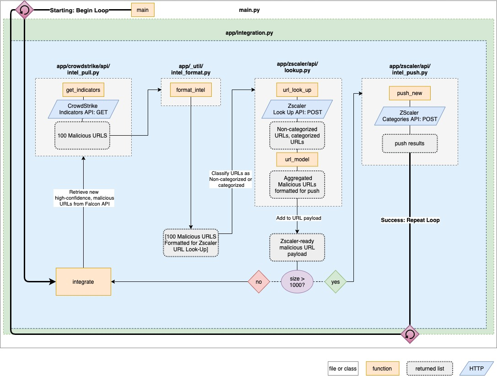

# Zscaler/Falcon X Threat Intelligence Integration

## Overview
CrowdStrike’s [Falcon X Threat Intelligence](https://www.crowdstrike.com/endpoint-security-products/falcon-x-threat-intelligence/) and [Falcon Endpoint Protection](https://www.crowdstrike.com/endpoint-security-products/falcon-insight-endpoint-detection-response/) device telemetry data can be easily shared with [Zscaler Zero Trust Exchange](https://www.zscaler.com/products/zero-trust-exchange) to provide stronger protection and increased visibility.

While running, the integration maintains a collection of malicious URLs from CrowdStrike’s Threat Intelligence platform by submitting new URLs and removing false positives, or deleted indicators, from the Zscaler platform’s URL block list feature.

### Known API Rate Limits
Zscaler limits their URL Lookup API to 40,000 queries per hour per customer. This integration accounts for this limitation, and was designed to perform a slow and steady Extract-Transform-Load loop built for stability.

If/when this limitation is removed, or if Zscaler has configured your account with a special exception, the `zs_max_calls_hourly` variable in `./config.py` can be updated with a higher hourly request counter.

# Getting Started
## Zscaler URL Category
1. Login to your ZIA tenant
2. Navigate to `Administratio”` -> `URL-Categories`
3. Add a new `URL Category` with the name `CrowdStrike Malicious URLs - High`
4. In the `URL Super Category` select `User-Defined`. The new category will not be accepted without any entries, so enter an arbitrary URL, and then save.

For further details, refer to the  [Zscaler URL Category documentation](https://help.zscaler.com/zia/adding-custom-url-categories).

## Download the Integration
```bash
$ git clone https://github.com/CrowdStrike/zscaler-FalconX-integration.git

$ cd zscaler-FalconX-integration
```

## Configure Variables

Update `config.py` with values for the following variables:

| Variable | Description |
|:-|:-|
| cs_clientID | CrowdStrike OAuth2 API Client ID. |
| cs_secret | CrowdStrike OAuth2 API Secret. |
| zs_username | Zscaler Username |
| zs_password | Zscaler Password |
| zs_apiKey | Zscaler API Key |

NOTE: The CrowdStrike API client and secret can be configured at [https://falcon.crowdstrike.com/support/api-clients-and-keys](https://falcon.crowdstrike.com/support/api-clients-and-keys).

### Launch the Integration

With Python 3.7+ installed:
```bash
python main.py
```

# Project Reference


## ./app/
| File | Description |
|:-|:-|
| [integration.py](app/integration.py) | Provides flow control. |

----

## ./app/crowdstrike/

| File | Description |
|:-|:-|
| [crowdstrike_auth.py](app/crowdstrike/crowdstrike_auth.py) | Handles Falcon API OAuth2 Authentication. |
| [api/intel_pull.py](app/crowdstrike/api/intel_pull.py) | Controller for handling HTTP connection with the Intel API. |
| [queuing/*](/app/crowdstrike/queuing) | Contains intermediary URL lists. During runtime files are populated with sets of malicious URLs pending transfer. |

----

## ./app/zscaler/

| File | Description |
|:-|:-|
| [zscaler_auth.py](app/zscaler/zscaler_auth.py) | Handles zscaler authentication. |
| [api/category.py](app/zscaler/api/category.py) | Controller for Zscaler's custom category API. |
| [api/intel_push.py](app/zscaler/api/intel_push.py) | Controller for pushing new Indicators to Zscaler custom category. |
| [api/lookup.py](app/zscaler/api/lookup.py) | Controller for Zscaler's URL Look Up API. |
| [queuing/*](app/zscaler/queuing) | Intermediary URL lists. During runtime files are populated with sets of malicious URLs pending transfer. |

---

## _util/

| File | Description |
|:-|:-|
| [intel_format.py](app/_util/intel_format.py) | Utility functions for parsing and formatting malicious URLs for Zscaler ingestion. |
| [logger.py](app/_util/logger.py) | Logging functions |
| [killswitch.py](app/_util/killswitch.py) | Utility functions for exiting loops during unhandled exceptions. |