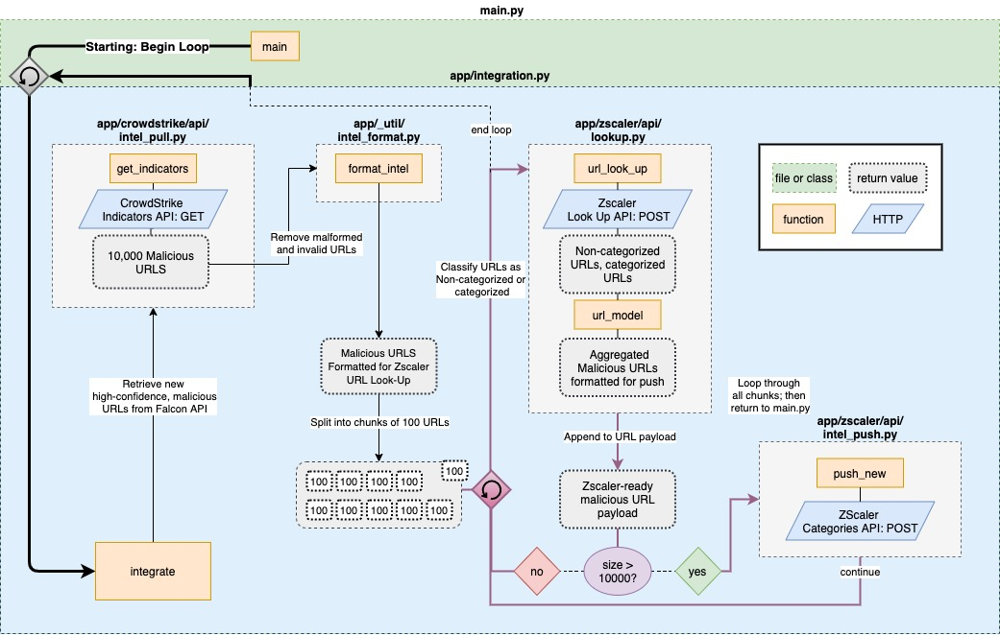

# zscaler-FalconX-integration

## Overview
CrowdStrike’s Falcon X threat intelligence and Falcon Endpoint Protection device telemetry data can be easily shared with Zscaler Zero Trust Exchange for seamless usage when integrations are activated to provide stronger protection and increased visibility.

While running, the integration maintains a collection of malicious URLs from CrowdStrike’s Intel platform by submitting new URLs and removing false positives, or deleted indicators, from the Zscaler platform’s URL block list feature. The integration is rate limited by Zscaler’s URL look-up API. Only 40,000 URLs can be queried per hour, so the integration was designed assuming that the service bottle necks at this particular phase of execution. The result is a slow and steady Extract-Transform-Load loop built for stability. 

# Getting Started
## Zscaler URL Category
First, log into your ZIA tenant and then navigate to “Administration” -> “URL-Categories", and then add a new URL category with the name 'CrowdStrike Malicious URLs - High', in the URL Super Category select 'User-Defined'. The new category will not be accepted without any entries, so enter an arbitrary URL, and then save.

[Zscaler URL Category documentation](https://help.zscaler.com/zia/adding-custom-url-categories)

## Download
```bash
git clone https://github.com/CrowdStrike/zscaler-FalconX-integration.git
cd zscaler-FalconX-integration
```
## Launch the Integration
Enter missing configuration values in config.py
- cs_clientID 
- cs_secret 
- zs_username 
- zs_password 
- zs_apiKey 

With Python 3.7+ installed:
```bash
python main.py
```

# Project Reference

## app/
- [integration.py](app/integration.py)
  - called by main module - provides flow control.
----

## crowdstrike/
- [crowdstrike_auth.py](app/crowdstrike/crowdstrike_auth.py)
  - Handles Falcon API OAuth2 Authentication.
- [api/intel_pull.py](app/crowdstrike/api/intel_pull.py)
  - Controller for handling HTTP connection with the Intel API.
- queuing/*
    - contains intermediary URL lists - during runtime, files are populated with sets of malicious URLs pending transfer.
----

## zscaler/
-  [zscaler_auth.py](app/zscaler/zscaler_auth.py)
    - Handles zscaler authentication.
-  [api/category.py](app/zscaler/api/category.py)
    - Controller for Zscaler's custom category API.
-  [api/intel_push.py](app/zscaler/api/intel_push.py)
    - Controller for pushing new Indicators to Zscaler custom category.
- [api/lookup.py](app/zscaler/api/lookup.py)
    - Controller for Zscaler's URL Look Up API.
- queuing/*
    - contains intermediary URL lists - during runtime, files are populated with sets of malicious URLs pending transfer.
----

## _util/
- [intel_format.py](app/_util/intel_format.py)
  - Contains utility functions for parsing and formatting malicious URLs for Zscaler ingestion.
- [logger.py](app/_util/logger.py)
  - Contains logging functions
- [killswitch.py](app/_util/killswitch.py)
  - Contains utility functions for exiting loops during unhandled exceptions.


